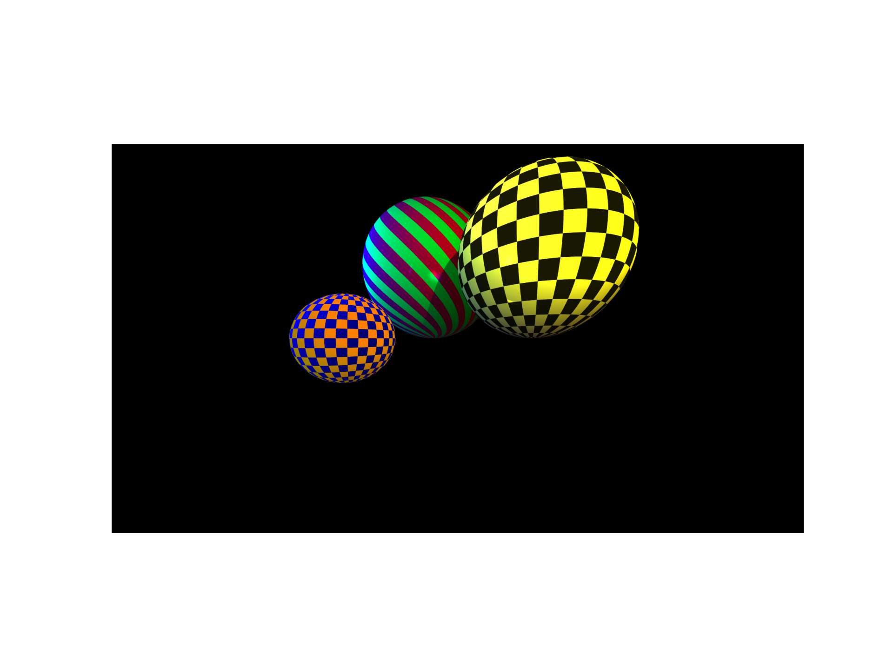
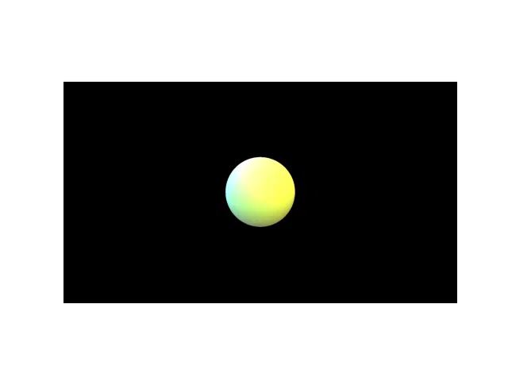
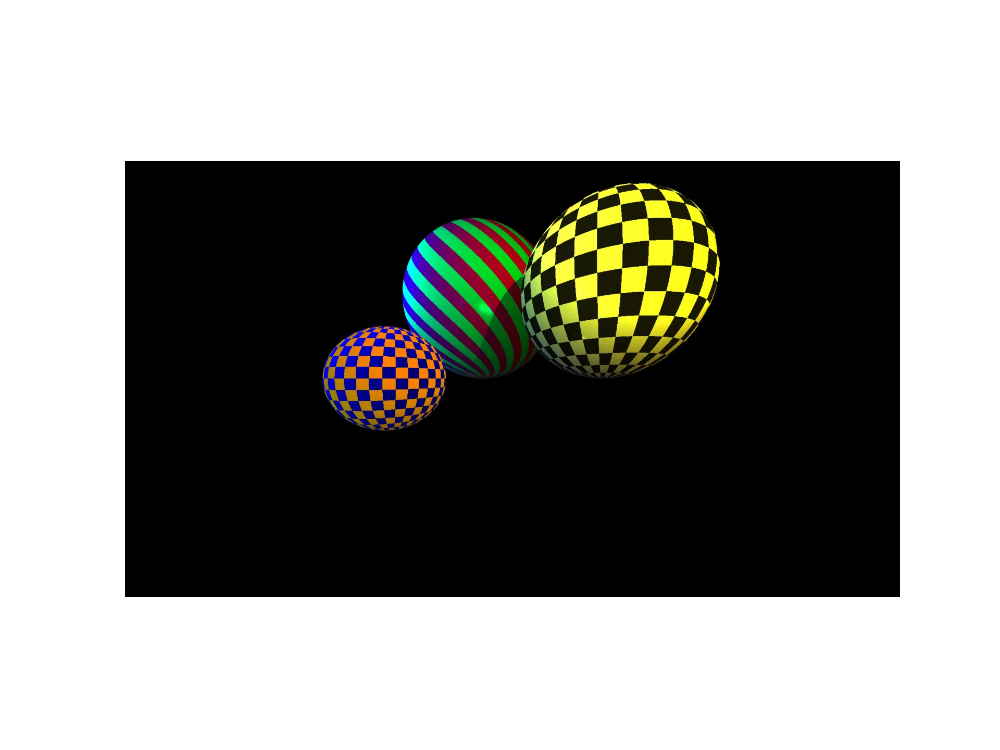

# RaytracX

RaytracX est un projet de programmation réalisé en python dans le cadre du cours *SMATB110 : Travaux pratiques de programmation* du parcours de Master en sciences mathématiques de l'Université de Namur.

Ce projet permet à l'utilisateur d'effectuer rapidement un rendu graphique simple d'un environnement simulé mathématiquement et de créer de petites animations.

---

## Initialisation

L'initialisation du projet qui suit se fait sur Windows

### Clone du projet

Dans un premier temps, cloner le projet via :
```git
git clone https://github.com/RedxClaw/raytracing
```

### Installation de uv

Pour initialiser le projet, utilisez le package manager [<u>uv</u>](https://docs.astral.sh/uv/getting-started/installation/) afin de gérer les dépendances requises pour le bon fonctionnement du projet.

Il peut être installer via la commande :

```bash
pip install uv
```

### Téléchargement des dépendances

Afin de télécharger tous les packages requis au bon fonctionnement du programme, taper la commande :

```bash
uv add -r .\requirements.txt
```

### Activation de l'environnement virtuel

Effectuer la commande
```bash
.\.venv\Scripts\Activate.ps1
```

---

## Création de scène

Deux scènes par défaut sont déjà installées dans les fichiers `objets_1.json` et `objets_2.json`. Un fichier `objets.json` est du format suivant :

```json
    {
    "sphere": [
        {// Sphère 1 
            "position": <Position>,
            "rayon": <Rayon>,
            "texture": {
                "motif": <Motif>,
                "couleurs": [
                    <Couleur>,
                    <Couleur>
                ]
            },
            "metallicite": <Metallicité>
        },
        {// Sphère 2
            "position": <Position>,
            "rayon": <Rayon>,
            "texture": {
                "motif": <Motif>,
                "couleurs": [
                    <Couleur>,
                    <Couleur>
                ]
            },
            "metallicite": <Metallicité>
        }
    ],
    "lumiere": [
        {// Lumière 1
            "position": <Position>,
            "intensite": <Intensité>,
            "couleur": <Couleur>
        },
        {// Lumière 2
            "position": <Position>,
            "intensite": <Intensité>,
            "couleur": <Couleur>
        }
    ]
}
```

Chaque valeur `<Position>` est une liste de 3 nombres réels représentant la position l'élément dans l'espace. Pour la sphère, la position considérée est celle du centre de la sphère

Les valeurs `<Rayon>`, `<Métallicité>` et `<Intensité>` Sont des valeurs réelles positives. Pour la métallicité, une valeur à 0 donnera un rendu mate de la surface, là ou une valeur plus élevée rendra la surface de plus en plus brillante.

Les valeurs `<motif>` doivent être choisies parmi `"unicolore"`, `"damier"` et `"spirale"`

Les valeurs `<couleur>` doivent être choisies parmi :
- "noir"
- "rouge"
- "orange" 
- "jaune"
- "vert"
- "bleu"
- "magenta"
- "cyan"
- "rose"
- "lime"
- "turquoise"
- "mauve"
- "blanc"

---

## Exécution du programme

Afin d'exécuter le programme et d'obtenir un rendu graphique de la scène, taper la commande :
```bash
.\.venv\Scripts\python.exe main.py
```

Dans le cadre de l'animation, remplacer le fichier `main.py` par `animation.py` dans la commande ci-dessus.

---

## Examples

- Example de génération de scène simple (via `main.py`) :



- 2 examples de génération d'animations via `animation.py` :

 

---

## Contributeurs
Ce projet a été réalisé par L. Daisne, S. Eischen et Y. Maljean avec l'encadrement de J. Ketcha Kouakep, C. Simal et R. Tchinda.